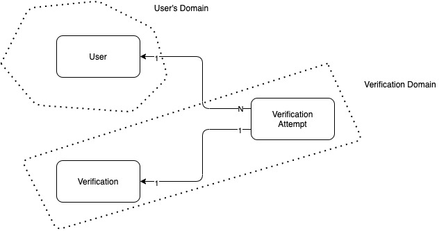

# A Basic Spring Boot Application

We will define a product that we want to build, and we will split into small chunks.(Requirment Oriented approach)

//TODO : Need to write Initial goals
Expose
Please find the following API used in our UI so far
http://localhost:9000/core-oauth/oauth/token
http://localhost:9100/core-admin/searchUser  
http://localhost:9100/core-admin/getActiveUser
http://localhost:9100/core-admin/getRoleList
http://localhost:9100/core-admin//getUserRoleList/PRODUCERUSER

Initial Goal
============
1. We want a web application to keep the employee records.
2. To begin with, we will present user with enrollment form.
3. User will type user details and submit.

Form Information
FirstName
LastName
EmailId
Description
Username
Password

## USER STORY 1
As a user of the application, I want to enroll to the system. 

##Tasks
1. Create a basic service with business logic (@Email and mailsender)
2. Create a basic API to access this service (REST API)
3. Create a Web page to ask the user to provide his details


## Setting up the Development Environment

Java 16 \
Download URI : https://tpd.io/jdk14

IDE : Community version of IntelliJ IDEA \
Download the latest

Testing tool : HTTPie to test our web application. (command line tester)\
Ref : https://tpd.io/httpie-install


## The Skeleton Web App

https://start.spring.io/

Project : Gradle \
Language : Java \
Spring Boot version : 2.5.2 \
group : com.hbs.edr \
artifact : enroll \
Description : User Enrolling Application \
Packaging : Jar \
Java : 16 

Dependencies \
Lombok \
Spring Web \
Validation

generate the project \
unzip the download \
copy to Intellij \
And new module from existing source \
cd enroll and ./gradlew bootRun to run the skeleton

```
2021-07-20 03:07:12.680  INFO 19819 --- [           main] w.s.c.ServletWebServerApplicationContext : Root WebApplicationContext: initialization completed in 676 ms
2021-07-20 03:07:12.989  INFO 19819 --- [           main] o.s.b.w.embedded.tomcat.TomcatWebServer  : Tomcat started on port(s): 8080 (http) with context path ''
2021-07-20 03:07:12.996  INFO 19819 --- [           main] com.hbs.edr.enroll.EnrollApplication     : Started EnrollApplication in 1.329 seconds (JVM running for 1.607)

```

## Spring Boot Autoconfiguration.

What we ger when we add the web dependency is an independently deployable web application that uses tomcat. \
Autoconfiguration feature

@SpringBootApplication groups severl other annotation.\
@EnableAutoConfiguration is one of them.\
That finds all the @Configuration annotated class from my source and the dependencies added.

Dependency that we have added spring-boot-starter-web has another dependency that is spring-boot-starter-tomcat\
Ref : https://tpd.io/starter-web-deps

spring-boot-starter-tomcat dependency contains tomcat-embed-core \
Apache library to start the tomcat embedded server. \
Main logic included in class name Tomcat

And

spring-boot-starter-web also depends on spring-boot-starter (core spring boot starter ref: https://tpd.io/sb-starter)\
which includes whole set of classes annotated with @Configuration. \
Those classes includes configure web servers, message brokers, error handlers, databases and many more \
Ref: https://tpd.io/auto-conf-packages

Class take care of embedded TomcatServer is ServletWebServerFactoryConfiguration Ref: https://tpd.io/swsfc-source 

TODO : Read the rest of the story :)


## Three-Tier, Three-Layer Architecture

Among web applications, three-tier design is the most popular one and widely extended,
1. Client tier:\
   This tier is responsible for the user interface. Typically, this is what we call the front end.
2. Application tier:\
   This contains all the business logic together with the interfaces to interact with it and the data interfaces for persistence. This maps to what we call the backend
3. Data store tier:\
   It's the database, file system, etc. that persists the application's data

Application tier is commonly designed using three layers
1. Business layer:\
   This includes the classes that model our domain and the business specifics. 
   It's where the intelligence of the application resides.
   Sometimes this layer is divided into two parts:
   domains (entities) and applications (services) providing business logic. 
2. Presentation layer:\
   In our case, it will be represented by the controller classes, which will provide the functionality to the web client.
   Our REST API implementation will reside here
3. Data layer:\
   This layer will be responsible for persisting our entities in a data storage, usually a database.
   It can typically include data access object (DAO) classes, 
   which work with objects that map directly to rows in a database,
   or repository classes,which are domain centric, 
   so they may need to translate from domain representations to the database structure.


Above architecture will help achieving loose coupling
1. All layers are interchangeable. 
   REST API can be replaced by other tool and this will help mocking the next layer while testing
2. The domain parts is isolated and independent of everything else. It's not mixed with interface or database specific
3. There is a clear seperation of responsibilities: A class to handle database storage of the object, a separate class for REST API, and another for business logic


Spring provides 3 different stereo type annotation for classes belongs to all three layers
1. The @Controller annotation is for the presentation layer. In our case, we will implement a REST interface usig controllers
2. The @Service annotation is for classes implementing business logic
3. The @Repository annotation is for the data layer, namely, the classes that interact with the database.

above annotation makes the classes spring managed components. \
When initializing the web context, Spring scans your packages, finds these classes, and loads them as beans in the context. \
Then, we can use dependency injection to wire (or inject) these beans and for example \
use services from our presentation layer (controllers)


## Managing our domains

### Domain Definition and Domain Driven Design


Submit user details (@Email validation)
generate activation key
send mail with activation key
Submit activation key

User Domain
1. User
   
Verification Domain
1. Verification attempt
2. Verification 



1. Users and Verifications are independent entities, They don't keep any references
2. Verification Attempts are always for a given user and a given verification conceptually. \
   There could be many attempts for the same verification, given that there is a limited number of generated verifications, \
   Also the same user may create many attempts since they can use the web application as manytime as they want. (Need to be revised)

Domain Driven Design
====================

3 objects has been grouped in to domains Ref : https://tpd.io/bounded-context

Design approach based on the domain is called domain driven design

For more reading on DDD
https://tpd.io/ddd-book
https://tpd.io/ddd-quickly

Going for monolithic first approach

Domain Classes
==============
com.hbs.edr.enroll.user
   1. User.java

com.hbs.edr.enroll.verification
1. Verification.java
2. VerificationAttempt.java

Intellij Add lombo plugin
Preferences -> Plugins
And Search for Lombok

Business Logic
==============

Once Identified the domain, We can think about business logic.

1. VerificationGeneratorService

Create Service Interface - VerificationGeneratorService \
Create an Empty Implementation Class, this should be annotated by @service \
Then write the test 
@Spy to stub an object, The Mockito extension will help to create a Random instance using the empty constructor and stubbing it for us to overide the behaviour\
@BeforEach This happens before Each Test\
run ./gradlew test with the empty class to fail first\
Now Implement the logic and run test should be success

2. Verify Attempt

Test Driven Development
=======================

First, you design the tests, which will fail at the beginning
Then you implement the logic to make them pass.

Create Service - Verification Service Interface
Create an object to get the in put from UI - VerificationAttemptDTO (We will use this DTO to validate data as well)

Create VerificatioServiceImpl with do nothing logic.
And then write the unit test.


Presentation Layer
=================


      


    


